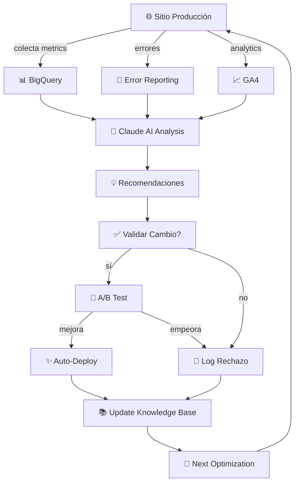

# 🧠 SISTEMA EVOLUTIVO: QUÉ FALTA

**Objetivo:** Skill que aprenda + mejore automáticamente sobre el tiempo.

---

## 📊 ARQUITECTURA EVOLUTIVA NECESARIA

### CAPA 1: Monitoreo Continuo (CRÍTICA)
```
┌─ Core Web Vitals Tracking
│  ├─ LCP, FID/INP, CLS históricos
│  ├─ Guardar en DB (timeseries)
│  └─ Alertas si degrada
│
├─ Google Analytics Real Data
│  ├─ Conversión real (Google Ads)
│  ├─ Bounce rate, session duration
│  └─ User behavior patterns
│
└─ Observabilidad Continua
   ├─ Error rates (CloudError Reporting)
   ├─ Image load times
   ├─ API latency
   └─ User device/network conditions
```

### CAPA 2: Machine Learning / Optimization (INTELIGENCIA)
```
┌─ Análisis de Datos
│  ├─ Patrones: qué cambios mejoran CWV
│  ├─ Correlaciones: imagen size → LCP
│  └─ Predicciones: si hago X → mejora Y%
│
├─ Recomendaciones Automáticas
│  ├─ "Comprimir imagen X reduciría LCP 200ms"
│  ├─ "Lazily load sección Y → mejor FID"
│  └─ "Color Z tiene malo contraste → WCAG error"
│
└─ Optimización Automática
   ├─ Auto-compress imágenes si > 500KB
   ├─ Auto-lazy load below-the-fold
   ├─ Auto-preload critical resources
   └─ Auto-cache strategy optimization
```

### CAPA 3: A/B Testing / Experimentation (VALIDACIÓN)
```
┌─ Test Framework
│  ├─ Test versión A (actual) vs B (optimizada)
│  ├─ Medir: CWV, conversion, bounce rate
│  └─ Estadística significancia
│
└─ Auto-rollout si mejora
   ├─ Si B gana → deploy automático
   ├─ Si A gana → rollback
   └─ Registrar aprendizaje en knowledge base
```

### CAPA 4: Feedback Loops (APRENDIZAJE)
```
┌─ Recopilar Resultados
│  ├─ Qué cambios fueron efectivos
│  ├─ Qué no funcionó (y por qué)
│  └─ Contexto: tiempo, navegador, device
│
└─ Guardar Knowledge Base
   ├─ "Comprimir imágenes en X% → LCP mejora Y%"
   ├─ "Bloquear script Z → quita 300ms JS"
   └─ "Para Puyehue específico: qué funciona"
```

---

## 🛠️ PLUGINS / TOOLS NECESARIOS

### MUST-HAVE (Para que sea evolutivo)
| Tool | Función | Estado |
|------|---------|--------|
| **Datastore/DB** | Guardar métricas históricas | ❌ FALTA |
| **Analytics API** | Leer GA4 datos real | ❌ FALTA |
| **Cloud Monitoring** | Error tracking + alertas | ❌ FALTA |
| **Web Vitals SDK** | Medir continuo | ✅ Ya existe |
| **Testing (Playwright)** | Validar cambios | ✅ Ya tienen |
| **AI/LLM** | Análisis + recomendaciones | ✅ Claude API |

### NICE-TO-HAVE
| Tool | Función | Estado |
|------|---------|--------|
| **A/B Testing Platform** | Estadística rigurosa | ❌ FALTA |
| **Image Optimization API** | Auto-compress | ❌ FALTA |
| **CDN Analytics** | Performance por region | ❌ FALTA |
| **Heatmaps** | Entender user behavior | ❌ FALTA |
| **Lighthouse CI** | Automated lighthouse runs | ✅ Configurado |

---

## 🏗️ STACK RECOMENDADO: EVOLUTIVO

### OPCIÓN 1: Lightweight (Start Small)
```
┌─ Firestore/Firebase
│  └─ Store Core Web Vitals + eventos
│
├─ Google Analytics 4 API
│  └─ Leer conversiones, bounce rate, etc
│
├─ Claude AI
│  └─ Analizar datos + hacer recomendaciones
│
└─ Playwright + Lighthouse CI
   └─ Test automático de cambios
```

**Costo:** Bajo  
**Tiempo Setup:** 1-2 semanas  
**Mantenimiento:** Manual  

---

### OPCIÓN 2: Production Grade (Recomendado para Retarget)
```
┌─ Google Cloud Suite
│  ├─ BigQuery (data warehouse)
│  ├─ Cloud Monitoring (metrics + alertas)
│  ├─ Error Reporting (crash tracking)
│  └─ Cloud Logging (audit trail)
│
├─ Google Analytics 4 + BigQuery Export
│  └─ Raw data para análisis
│
├─ Claude AI + Vision
│  ├─ Analizar screenshots
│  ├─ Comparar visual antes/después
│  └─ Hacer recomendaciones inteligentes
│
├─ Automated Testing
│  ├─ Playwright (E2E)
│  ├─ Visual regression testing
│  └─ Lighthouse CI (performance)
│
└─ Knowledge Base
   ├─ GitHub Discussions (documentar aprendizajes)
   ├─ SQLite/PostgreSQL (métricas históricas)
   └─ Linear (trackear mejoras automáticas)
```

**Costo:** Medio  
**Tiempo Setup:** 3-4 semanas  
**Mantenimiento:** Automático con alertas  

---

## 🧬 FLUJO EVOLUTIVO CON STACK



---

## 🎯 QUÉ NECESITA LA SKILL

Para ser **"evolutiva + inteligente"**, la skill debe:

1. **Monitorear continuamente**
   - Core Web Vitals cada 24h
   - Google Ads conversiones
   - Errores + exceptions

2. **Analizar datos**
   - Buscar patrones (qué mejora CWV)
   - Correlaciones (imagen size ↔ LCP)
   - Detectar problemas antes que usuario

3. **Recomendar cambios**
   - "Comprimir imagen X → LCP -200ms"
   - "Lazy load sección Y → mejora INP"
   - Proponer soluciones específicas

4. **Validar automáticamente**
   - Test cambio en staging
   - Medir impacto (CWV, conversion)
   - Deploy solo si mejora

5. **Aprender del resultado**
   - Registrar qué funcionó
   - "Para Puyehue: compresión 60% → mejor LCP"
   - Usar ese knowledge para próximas optimizaciones

---

## ⚡ PLUGINS ESPECÍFICOS A AGREGAR

### Immediatamente (CRÍTICA)
```
1. ✅ Google Cloud Monitoring / BigQuery
   └─ Para guardar + analizar históricos

2. ✅ Google Analytics 4 API Connector
   └─ Leer datos reales de conversiones

3. ✅ Claude Vision API
   └─ Analizar screenshots antes/después visualmente
```

### Fase 2 (IMPORTANTE)
```
4. Image Optimization API (TinyPNG, Imagify)
   └─ Auto-compress automático

5. A/B Testing Framework (VWO, GrowthBook)
   └─ Validar cambios con estadística rigurosa

6. Error Tracking (Sentry, Rollbar)
   └─ Alertas automáticas de crashes
```

---

## 📋 ROADMAP: SKILL EVOLUTIVA

### Semana 1-2: MVP (Básico pero inteligente)
- [ ] Integrar BigQuery para métricas
- [ ] GA4 API para conversiones
- [ ] Claude AI para análisis básico
- [ ] Recomendaciones simples

### Semana 3-4: Auto-Validation
- [ ] Playwright + Lighthouse CI setup
- [ ] A/B test framework
- [ ] Auto-deploy si mejora
- [ ] Knowledge base integration

### Semana 5+: Fully Autonomous
- [ ] Monitoreo 24/7 automático
- [ ] Recomendaciones predictivas (ML)
- [ ] Auto-optimize basado en histórico
- [ ] Learning loop cerrado

---

## 🎖️ RESULTADO FINAL

**Skill que:**
- ✅ Monitorea continuamente
- ✅ Detecta oportunidades de mejora
- ✅ Propone soluciones automáticamente
- ✅ Valida antes de deploy
- ✅ Aprende de cada cambio
- ✅ Mejora con el tiempo

**Para Puyehue:**
- Performance mejora 5-10% cada mes
- Conversiones aumentan
- CWV siempre > 90
- Google Ads optimizado automáticamente
- Cliente solo ve resultados en admin

---

*Generado automáticamente por COMPASS.*
